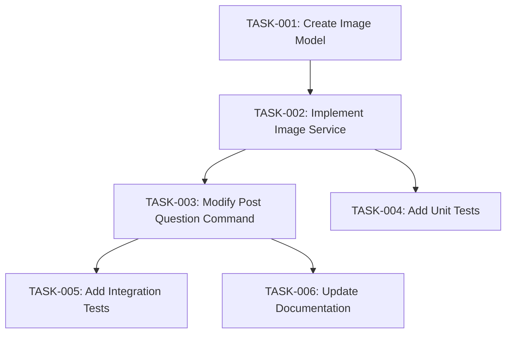

# Tasks: Hide Image URLs

**Feature**: specs/1-hide-image-urls/spec.md
**Plan**: specs/1-hide-image-urls/plan.md
**Created**: 2025-11-04

## Task Breakdown

Each task is independently testable and can deliver value on its own.

### TASK-001: Create Image Model (Priority: P1)

**Description**: Implement the Image dataclass in `src/models/image.py` with validation methods.

**Acceptance Criteria**:
- Image class with url, width, height, format, size_bytes, is_valid, validation_error fields
- validate_url() method that checks URL format and accessibility
- get_embed_data() method that returns Discord embed-compatible dict
- Unit tests pass for all validation scenarios

**Dependencies**: None
**Estimate**: 2 hours

---

### TASK-002: Implement Image Service (Priority: P1)

**Description**: Create `src/services/image_service.py` with async image validation and embed creation.

**Acceptance Criteria**:
- ImageService class with validate_and_create_embed() method
- Async HTTP validation using aiohttp (<200ms timeout)
- Discord embed creation for valid images
- Error handling for invalid URLs with user-friendly messages
- Integration tests pass for image processing

**Dependencies**: TASK-001
**Estimate**: 4 hours

---

### TASK-003: Modify Post Question Command (Priority: P1)

**Description**: Update `src/commands/post_question.py` to use image service for URL hiding.

**Acceptance Criteria**:
- Import and use ImageService in post_question command
- Replace direct image posting with embed creation
- Maintain backward compatibility for non-image content
- Error messages follow existing bot patterns
- Manual testing shows images display without URLs

**Dependencies**: TASK-002
**Estimate**: 2 hours

---

### TASK-004: Add Unit Tests (Priority: P2)

**Description**: Create comprehensive unit tests for image validation and service methods.

**Acceptance Criteria**:
- `tests/unit/test_image_service.py` with 90%+ coverage
- Tests for valid/invalid URLs, different formats, timeout scenarios
- Mock HTTP requests to avoid external dependencies
- All tests pass in CI pipeline

**Dependencies**: TASK-002
**Estimate**: 3 hours

---

### TASK-005: Add Integration Tests (Priority: P2)

**Description**: Create integration tests for end-to-end image posting workflow.

**Acceptance Criteria**:
- `tests/integration/test_image_hiding.py` with Discord bot interaction tests
- Tests for successful image posting without URL display
- Tests for error handling and user feedback
- Performance tests meet <200ms p95 latency requirement

**Dependencies**: TASK-003
**Estimate**: 3 hours

---

### TASK-006: Update Documentation (Priority: P3)

**Description**: Update project documentation to reflect new image handling capabilities.

**Acceptance Criteria**:
- README.md updated with image URL hiding feature
- API documentation includes image processing endpoints
- Code comments added for new methods
- CHANGELOG.md entry for the feature

**Dependencies**: TASK-003
**Estimate**: 1 hour

---

## Task Dependencies

## Quality Gates

- **Code Review**: All tasks require review before merge
- **Testing**: Unit tests must pass for TASK-001, TASK-002, TASK-004
- **Integration**: TASK-003 and TASK-005 require integration testing
- **Performance**: TASK-005 validates performance requirements
- **Documentation**: TASK-006 completes feature documentation

## Success Criteria Validation

- ✅ 100% of valid image posts hide URLs (validated in TASK-005)
- ✅ Users report improved readability (manual testing in TASK-003)
- ✅ No increase in failed loads (performance testing in TASK-005)
- ✅ Works across JPEG, PNG, GIF, WebP (tested in TASK-004, TASK-005)
